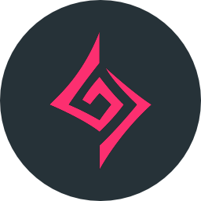
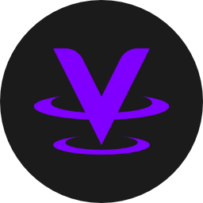
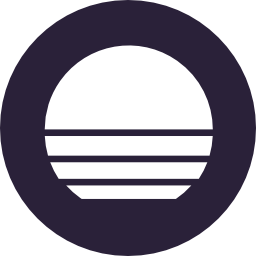
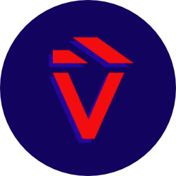
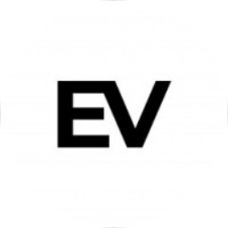

---

Hey 👋! I'm Ringo Hoffmann, also known as zekro. I am a <!--age:1998-12-12-->26 years old self-taught full stack developer from Germany.

### My current Stack

**Languages & Frameworks:**

 &nbsp;&nbsp;
 &nbsp;&nbsp;
 &nbsp;&nbsp;
 &nbsp;&nbsp;
 &nbsp;&nbsp;
 &nbsp;&nbsp;
 &nbsp;&nbsp;

**DevOps Tools & Services:**

 &nbsp;&nbsp;
 &nbsp;&nbsp;
 &nbsp;&nbsp;
 &nbsp;&nbsp;
 &nbsp;&nbsp;
 &nbsp;&nbsp;
 &nbsp;&nbsp;
 &nbsp;&nbsp;
 &nbsp;&nbsp;

**IaaS:**

 &nbsp;&nbsp;
 &nbsp;&nbsp;
 &nbsp;&nbsp;

### About Me

Since April 2022, I am working full-time as Go back end developer. I've started coding [around 2014](https://pastebin.com/mpve8t8U) writing [ComputerCraft](https://computercraft.cc/) scripts in Lua. Later, I got into developing [Discord](https://discord.com) bots in Java using [JDA](https://github.com/DV8FromTheWorld/JDA). Since then, I worked my way through various techniques and languages (as you can see above).

Like every dev, I love deploying stuff on linux servers—preferably using Docker in combination with docker-compose—and creating full-stack service networks using stuff like traefik, NGINX, MinIO, Redis, MariaDB, PostgreSQL, Elasticsearch, MongoDB, MeiliSearch or Neo4J.

Because I am lazy, I automate **everything**. Even [this readme is automated](https://blog.zekro.de/ghreadme-actions/)! To do so, I mostly use CI/CD tools like GitHub Actions, TravisCI or Jenkins.

As well, as It might be obvious at this point, I am a huge fan of open source. I have created quite a bunch of projects—from large Discord bots like [shinpuru](https://github.com/zekroTJA/shinpuru) to full-stack web apps like [myrunes.com](https://github.com/myrunes) or [ranna](https://github.com/ranna-go) over libraries like [timedmap](https://github.com/zekroTJA/timedmap) or [pytter](https://github.com/zekroTJA/pytter) to Minecraft Forge mods like [MagicStaffs](https://github.com/zekroTJA/MagicStaffs) or [ForgeDiscordRPC](https://github.com/zekroTJA/ForgeDiscordRPC)—which are all available free and open on GitHub.

Besides all of that, I also create videos on my [YouTube channel](https://youtube.com/zekrommaster110) about various development and tech topics. Also, I have a [blog](https://blog.zekro.de/) where I post informational and opinionated posts about these topics as well. Also, I really like [photography](https://gallery.zekro.de) as well as cooking.

<h4>A collection of apps I've created or worked on.</h4>
&nbsp;&nbsp;
&nbsp;&nbsp;
&nbsp;&nbsp;
&nbsp;&nbsp;
&nbsp;&nbsp;
&nbsp;&nbsp;
&nbsp;&nbsp;
&nbsp;&nbsp;

<h6>Most of the logos are designed by <a href="https://github.com/luxtracon">@luxtracon</a>.</h6>

---

&nbsp;&nbsp;&nbsp;

 

  
Click here to see my Wakatime stats 😉

   
  

---

<h2>Projects recently commited to</h2>

<!--CURRENT_PROJECTS_BEGIN-->
<!--CURRENT_PROJECTS_END-->

 
 

  
 Visitors since 2020-07-08:  
   
 <small>
  <a href="https://github.com/zekroTJA/visitor-count">
    👉 <i>visitor counter</i>
  </a>
</small>
