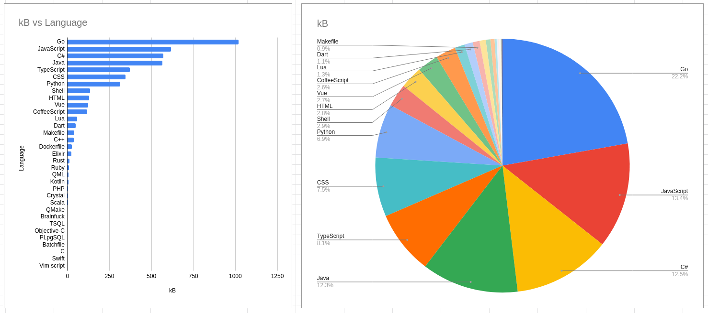

Hey 👋! I'm Ringo Hoffman, also known as zekro, and I'm a passionate german full stack developer in the age of `{currentYear - 1998}`.

I love playing with web technologies, creating web applications and building automatic pipelines to deploy them. I'm a huge lover of docker and linux. Mostly, I'm working with C# (.NET Core/Framework), Go and TypeScript, but I'm also verry experienced using stuff like Python, Java, Elixir, C++, Lua or Dart.

Here you can see a usage statistic over all my public and private github repositories.  
  
> Stats from 2020-09-10.  
> Collected with [this script](https://github.com/zekroTJA/gitlangstats).

## My current main projects

- [**shinpuru**](https://github.com/zekroTJA/shinpuru)  
  A multi-purpose Discord bot with backups, twitch notifications, moderation, code execution, a web interface and much more. Built with Go and Angular and using MySQL, Redis and MinIO.

- [**myrunes**](https://github.com/myrunes)  
  A web application to store League of Legends rune pages. Built with Go, Vue and Flutter and using MongoDB.

- [**supercharge**](https://github.com/zekroTJA/supercharge)  
  A web analytics tool to record and analyze League of Legends champion mastery points. Built with ASP.NET Core (C#) and Angular on top of PostgreSQL.

- [**voidseeker**](https://github.com/zekroTJA/voidseeker)  
  An image storage, indexing and searching utility. Built with ASP.NET Core (C#) and React on top of Elasticsearch and MinIO.